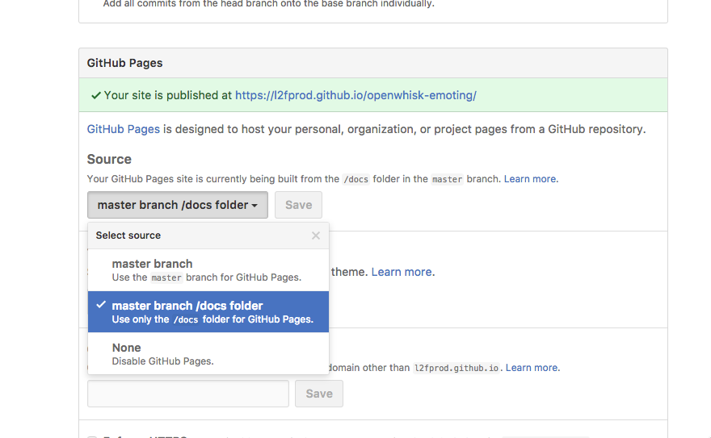

# Capture audience feedback with a serverless app

:warning: WORK IN PROGRESS

[](https://travis-ci.org/IBM-Bluemix/openwhisk-emoting) [](https://coveralls.io/github/IBM-Bluemix/openwhisk-emoting?branch=master)

You are giving this presentation and as attendees leave the room you'd like to get a quick feel about how you did. *Emoting* mimics the smiley terminals you may see at the airport security or whenever you are queueing somewhere.

   [](https://youtu.be/5btqydWZ8u0 "emoting")

## Overview

  
  
  

Built using the IBM Bluemix, the application uses:
* IBM Bluemix OpenWhisk to host the backend
* Cloudant to persist the data
* GitHub Pages to host the frontend

No runtime to deploy, no server to manage :)


<details>
<summary></summary>
architecture
  digraph G {
    node [fontname = "helvetica"];
    rankdir=LR;
    user -> github;
    github -> openwhisk [label="API Calls"];
    openwhisk -> cloudant;
    github [shape=circle style=filled color="%234E96DB" fontcolor=white label="GitHub Pages"];
    openwhisk [shape=circle style=filled color="%2324B643" fontcolor=white label="OpenWhisk"];
    cloudant [shape=circle style=filled color="%234E96DB" fontcolor=white label="Cloudant"];
  }
architecture
</details>

## Application Requirements

* IBM Bluemix account. [Sign up][bluemix_signup_url] for Bluemix, or use an existing account.

## Running the app on top of GitHub Pages and OpenWhisk

1. Clone or fork the repository https://github.com/IBM-Bluemix/openwhisk-emoting

1. Checkout the code

1. Ensure your [OpenWhisk command line interface](https://console.ng.bluemix.net/openwhisk/cli) is property configured with:

   ```
   wsk list
   ```

   This shows the packages, actions, triggers and rules currently deployed in your OpenWhisk namespace.

1. Create a Cloudant service in IBM Bluemix

1. Copy the file named template-local.env into local.env

   ```
   cp template-local.env local.env
   ```

1. Get the Cloudant service credentials from the Bluemix dashbaord and replace placeholders in `local.env` with corresponding values (url, username and password). These properties will be injected into a package so that all actions can get access to the database.

1. Deploy the actions to OpenWhisk

   ```
   ./deploy.sh --install
   ```

1. Expose the OpenWhisk actions as REST endpoints

   ```
   ./deploy.sh --installApi
   ```

1. Make note of your API base path in the output. The base path looks like `https://123456-abcd-7890123-gws.api-gw.mybluemix.net/emoting/1`.

1. Edit `docs/js/emoting.js` and change the `apiUrl` value to your API base path.

1. Commit the `docs/js/emoting.js` file.

1. Enable GitHub Pages on your repo. When doing so, select the option to use the `docs` folder in the master branch.

   

## Running the app locally

1. Follow the previous steps to deploy the OpenWhisk actions.

1. Make sure to edit `docs/js/emoting.js`

1. Install dependencies

   ```
   npm install
   ```

1. Start the local web server

   ```
   npm start
   ```

1. Point your browser to http://127.0.0.1:8080

## Code Structure

| File | Description |
| ---- | ----------- |
|[**question.create.js**](actions/question.create.js)| Creates a new question. |
|[**question.read.js**](actions/question.read.js)| Returns the text of a question based on its ID. |
|[**question.stats.js**](actions/question.stats.js)| Returns results about a given question. |
|[**rating.create.js**](actions/rating.create.js)| Called when a user taps on one of the rating. |
|[**options.js**](actions/options.js)| Implements the OPTIONS verb for the actions exposed through the OpenWhisk API Gateway. |
|[**deploy.sh**](deploy.sh)|Helper script to install, uninstall, update the OpenWhisk actions used by the application.|

## License

See [License.txt](License.txt) for license information.

---

This project is a sample application created for the purpose of demonstrating a serverless app with OpenWhisk. The program is provided as-is with no warranties of any kind, express or implied.

[bluemix_signup_url]: https://console.ng.bluemix.net/?cm_mmc=GitHubReadMe
